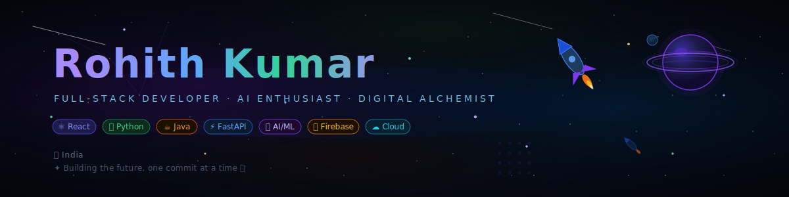

<!-- ================================================================ -->
<!--   ROHITH KUMAR — FINAL ULTIMATE GITHUB PROFILE README v4.0      -->
<!--   Galaxy Theme · Every Top-Profile Feature · Java + Supabase    -->
<!-- ================================================================ -->

<div align="center">

</div>

<!-- Wave top -->


<br/>

<!-- Typing SVG -->
<p align="center">
  
</p>

<!-- Badge row -->
<p align="center">
  
  &nbsp;
  
  &nbsp;
  
  &nbsp;
  
  &nbsp;
  
</p>

<br/>

---

## 🌌 &nbsp; Who Am I?

```typescript
const rohith: Developer = {
  name        : "Rohith Kumar",
  role        : "Full-Stack Developer & AI Enthusiast",
  education   : "B.Tech Computer Science 🎓",
  location    : "India 🇮🇳",
  languages   : ["Python", "Java", "JavaScript", "TypeScript", "C", "Dart"],
  frontend    : ["React", "TailwindCSS", "Vite", "Flutter"],
  backend     : ["FastAPI", "Node.js", "Java (Spring Boot)", "Streamlit"],
  databases   : ["PostgreSQL", "Supabase", "MongoDB", "Firebase"],
  cloud       : ["AWS", "GCP", "Docker", "Vercel", "Render"],
  ai_stack    : ["LangChain", "OpenAI API", "NumPy", "Pandas", "Selenium"],
  devTools    : ["Git", "GitHub", "Postman", "Figma", "Notion", "Arduino"],
  passions    : ["Web Dev", "AI/ML", "Hackathons", "Open Source"],
  currentFocus: "Building intelligent, production-ready systems 🧠",
  funFact     : "I debug best at 2am with lo-fi music 🎵",
  goal        : "Build tech that actually changes lives 🌍",
  openTo      : ["Internships", "Collaborations", "Hackathons", "Mentorship"],
};
// 🚀 Status: Currently building something epic → stay tuned!
```

<br>

---

## 🔭 &nbsp; What I'm Up To

<table>
<tr>
<td width="50%" valign="top">

### 🛠️ Building Right Now
- 🌐 Full-stack apps — **React + FastAPI + Supabase**
- ☕ REST microservices — **Java Spring Boot**
- 🤖 AI pipelines — **LangChain + OpenAI API**
- 📱 Cross-platform apps — **Flutter + Dart**
- 🐳 Dockerised deployments on **AWS / GCP**

</td>
<td width="50%" valign="top">

### 📚 Currently Learning
- 🧠 **System Design** — Scalable distributed systems
- ⚡ **DSA** — LeetCode daily grind
- ☁️ **AWS Solutions Architect** certification
- 🔗 **LangChain + RAG** — AI agent pipelines
- 🔷 **Supabase** — Postgres-powered BaaS
- 🔒 **Auth & Security** — OAuth2, JWT, RBAC

</td>
</tr>
</table>

<br>

---

## 🌟 &nbsp; Featured Projects

<table>
<tbody><tr>
<td width="50%">

### 🏦 Modern Digital Banking Dashboard
A full-stack modern digital banking dashboard with secure authentication, account management, transactions, budgeting, bills, rewards, insights, and alerts.

**Stack:** React · FastAPI · TailwindCSS · PostgreSQL

[](https://github.com/rohitkumarnaidu/Modern-Digital-Banking-Dashboard)

</td>
<td width="50%">

### 🤖 Agentic Edu Research Assistant
Autonomous Multi-Agent Research Scientist — built for AI IGNITE 2025. Uses multi-agent orchestration to autonomously perform academic research tasks.

**Stack:** Python · LangChain · OpenAI API · FastAPI

[](https://github.com/rohitkumarnaidu/agentic-edu-research-assistant)

</td>
</tr>
<tr>
<td width="50%">

### 🌾 Multilingual Mandi AI
AI-powered multilingual agricultural marketplace assistant helping farmers access market data and insights in their native language.

**Stack:** JavaScript · React · AI/NLP · FastAPI

[](https://github.com/rohitkumarnaidu/multilingual-mandi-ai)

</td>
<td width="50%">

### 📄 Auto AI Academic Formatter
Automated AI-powered academic document formatter that structures and formats research manuscripts to meet journal/conference standards.

**Stack:** Python · AI · Document Processing

[](https://github.com/rohitkumarnaidu/-Auto-AI-Automated-Academic-Docx-Manuscript-Formatter)

</td>
</tr>
</tbody></table>

<br>

---

## 📌 &nbsp; Pinned Repositories

<p>
  <a href="https://github.com/rohitkumarnaidu/Modern-Digital-Banking-Dashboard">
    
  </a>
  &nbsp;
  <a href="https://github.com/rohitkumarnaidu/agentic-edu-research-assistant">
    
  </a>
</p>
<p>
  <a href="https://github.com/rohitkumarnaidu/multilingual-mandi-ai">
    
  </a>
  &nbsp;
  <a href="https://github.com/rohitkumarnaidu/-Auto-AI-Automated-Academic-Docx-Manuscript-Formatter">
    
  </a>
</p>

<br>

---

## 🛠️ &nbsp; Technology Universe

<div align="center">

### 💬 Languages


### ⚛️ Frontend & Mobile


### ⚙️ Backend & APIs


### 🗄️ Databases & BaaS


### ☁️ Cloud & DevOps


### 🤖 Data, AI & Tools


</div>

<br/>

<details>
<summary>📋 &nbsp; View full stack as badges</summary>
<br/>
<div align="center">


</div>
</details>

<br>

---

## 📊 &nbsp; GitHub Galaxy Stats

<!-- Activity graph (full width) -->
<p align="center">
  
</p>

<br/>

<!-- Stats + Streak side by side -->
<p align="center">
  
  &nbsp;
  
</p>

<!-- Top langs + LeetCode -->
<p align="center">
  
  &nbsp;
  
</p>

<br>

---

## 📊 &nbsp; Profile Summary Card

<!-- Full profile summary with language breakdown, repos, stars, commits -->
<p align="center">
  
</p>

<p align="center">
  
  &nbsp;
  
  &nbsp;
  
  &nbsp;
  
</p>

<br/>

---

## ⏱️ &nbsp; WakaTime — Live Coding Analytics

<div align="center">

<!-- Real WakaTime data populated by GitHub Actions -->

</div>

<!--START_SECTION:waka-->


**🐱 My GitHub Data** 

> 📦 ? Used in GitHub's Storage 
 > 
> 🏆 307 Contributions in the Year 2026
 > 
> 🚫 Not Opted to Hire
 > 
> 📜 12 Public Repositories 
 > 
> 🔑 0 Private Repositories 
 > 
**I'm a Night 🦉** 

```text
🌞 Morning                15 commits          █░░░░░░░░░░░░░░░░░░░░░░░░   04.12 % 
🌆 Daytime                76 commits          █████░░░░░░░░░░░░░░░░░░░░   20.88 % 
🌃 Evening                200 commits         ██████████████░░░░░░░░░░░   54.95 % 
🌙 Night                  73 commits          █████░░░░░░░░░░░░░░░░░░░░   20.05 % 
```
📅 **I'm Most Productive on Monday** 

```text
Monday                   70 commits          █████░░░░░░░░░░░░░░░░░░░░   19.23 % 
Tuesday                  52 commits          ████░░░░░░░░░░░░░░░░░░░░░   14.29 % 
Wednesday                52 commits          ████░░░░░░░░░░░░░░░░░░░░░   14.29 % 
Thursday                 68 commits          █████░░░░░░░░░░░░░░░░░░░░   18.68 % 
Friday                   30 commits          ██░░░░░░░░░░░░░░░░░░░░░░░   08.24 % 
Saturday                 43 commits          ███░░░░░░░░░░░░░░░░░░░░░░   11.81 % 
Sunday                   49 commits          ███░░░░░░░░░░░░░░░░░░░░░░   13.46 % 
```


📊 **This Week I Spent My Time On** 

```text
🕑︎ Time Zone: Asia/Kolkata

💬 Programming Languages: 
Python                   4 hrs 22 mins       ███████░░░░░░░░░░░░░░░░░░   29.59 % 
JavaScript               2 hrs 11 mins       ████░░░░░░░░░░░░░░░░░░░░░   14.82 % 
Other                    1 hr 49 mins        ███░░░░░░░░░░░░░░░░░░░░░░   12.35 % 
Bash                     1 hr 42 mins        ███░░░░░░░░░░░░░░░░░░░░░░   11.53 % 
Markdown                 1 hr 12 mins        ██░░░░░░░░░░░░░░░░░░░░░░░   08.19 % 

🔥 Editors: 
VS Code                  9 hrs 37 mins       ████████████████░░░░░░░░░   65.04 % 
Antigravity              5 hrs 10 mins       █████████░░░░░░░░░░░░░░░░   34.96 % 
```


 Last Updated on 28/03/2026 14:27:09 UTC
<!--END_SECTION:waka-->

---


---

## 🎮 &nbsp; Random Dev Joke

<div align="center">
  
</div>

<br>

---

## 🏆 &nbsp; GitHub Achievements

<div align="center">
  
  &nbsp;
  
  &nbsp;
  
</div>

<br>

---

## 📈 &nbsp; Contribution Heatmap

<p align="center">
  
</p>

<br>

---

## 🔝 &nbsp; Top Contributed Repos

<p align="center">
  
</p>

<br/>

---

## 📊 &nbsp; GitHub Metrics

<p align="center">
  
  &nbsp;
  
</p>
<p align="center">
  
</p>

<br/>

---

## 💬 &nbsp; Testimonials & Recommendations

<!--
  Colleagues, mentors, or collaborators can write short testimonials about working with you.
  This builds social proof and credibility!
  
  Example format:
  
  > "Rohith is an exceptional developer who consistently delivers high-quality code. His expertise in full-stack development and AI integration helped our team ship features 2x faster."
  > 
  > **— Jane Doe**, Senior Engineer at Tech Corp

  To add testimonials, either:
  - Ask colleagues/mentors to provide quotes via email/LinkedIn
  - Collect from hackathon teammates or open-source collaborators
  - Display as blockquotes like the example above
-->

<div align="center">

| 💬 | Person | What they said |
|:---:|:---:|:---|
| 🌟 | **Mentor / Teammate name** | *"Add a real quote from someone you worked with at a hackathon, project or college. Reach out to teammates and ask!"* |

</div>

> 💡 Ask teammates from your hackathon projects to give you a 1-line quote — paste it here!

<br/>

---

## 📰 &nbsp; Recent GitHub Activity

<!--START_SECTION:activity-->
<!--END_SECTION:activity-->

<br>

---

## 🎯 &nbsp; Mission: 2025

```
╔══════════════════════════════════════════════════════════════╗
║                  ROHITH'S 2025 MISSION LOG                   ║
╠══════════════════════════════════════════════════════════════╣
║  [ ] 🏆  Win a national hackathon                            ║
║  [ ] 🌐  Ship 3 production-level full-stack apps             ║
║  [ ] ⭐  Hit 50+ GitHub stars across repos                   ║
║  [ ] 🤝  Contribute to 5+ open-source projects              ║
║  [ ] 📝  Launch a dev blog or YouTube channel                ║
║  [ ] ☕  Master Java Spring Boot microservices               ║
║  [ ] 🔷  Build a full product with Supabase + React          ║
║  [ ] ☁️  Get AWS Cloud Practitioner certified                ║
║  [ ] 🤖  Ship an AI SaaS product to real users               ║
║  [ ] 📱  Publish a Flutter app on the Play Store             ║
╚══════════════════════════════════════════════════════════════╝
```

<br>

---

## 🌐 &nbsp; Connect With Me

<p align="center">
  <a href="https://github.com/rohitkumarnaidu">
    
  </a>&nbsp;
  <a href="https://linkedin.com/in/rohitkumarnaidu">
    
  </a>&nbsp;
  <a href="mailto:your.email@gmail.com">
    
  </a>&nbsp;
  <a href="https://yourportfolio.com">
    
  </a>&nbsp;
  <a href="https://x.com/yourhandle">
    
  </a>&nbsp;
  <a href="https://leetcode.com/rohitkumarnaidu">
    
  </a>&nbsp;
  <a href="https://www.hackerrank.com/yourprofile">
    
  </a>&nbsp;
  <a href="https://dev.to/yourprofile">
    
  </a>
</p>

<br>

---

## ✍️ &nbsp; Dev Quote

<div align="center">
  
</div>

<br/>

## 🐍 &nbsp; Contribution Snake

<p align="center">
  <picture>
    <source media="(prefers-color-scheme: dark)" srcset="https://raw.githubusercontent.com/rohitkumarnaidu/rohitkumarnaidu/output/github-contribution-grid-snake-dark.svg"/>
    <source media="(prefers-color-scheme: light)" srcset="https://raw.githubusercontent.com/rohitkumarnaidu/rohitkumarnaidu/output/github-contribution-grid-snake.svg"/>
    
  </picture>
</p>

<!-- Wave footer -->


<p align="center">
  
  <br/><br/>
  <b>⭐ Drop a star on any project you find useful — it genuinely helps!</b>
  <br/>
  <sub>🚀 Let's build something legendary together 🌌</sub>
</p>


