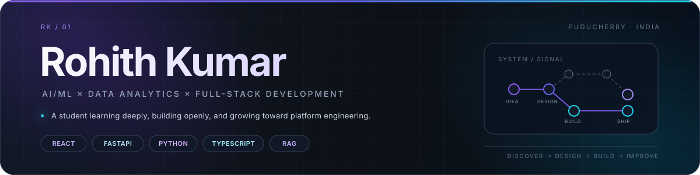
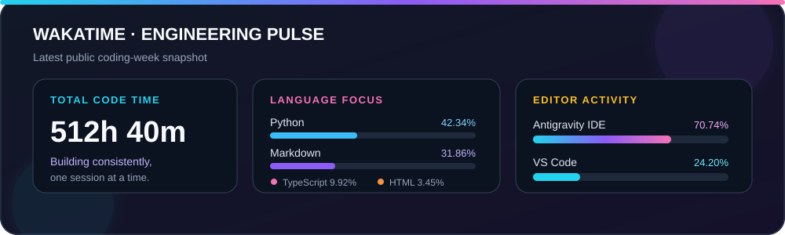

<a id="top"></a>

<div align="center">
  

  

  <p><b>Learning deeply. Building openly. Turning data and ideas into useful software.</b></p>

  <strong>EXPLORE THE PROFILE</strong><br />

  <a href="#about">About</a> ·
  <a href="#building">Building</a> ·
  <a href="#projects">Projects</a> ·
  <a href="#open-source">Open Source</a> ·
  <a href="#toolkit">Toolkit</a> ·
  <a href="#wakatime">WakaTime</a> ·
  <a href="#metrics">Metrics</a> ·
  <a href="#connect">Connect</a>

  <br /><br />

  <strong>CONNECT &amp; TRACK</strong><br />

  <a href="https://www.linkedin.com/in/bappadala-rohith-kumar-naidu-19377130a"></a>
  <a href="mailto:rohitbappadala@gmail.com"></a>
  <a href="https://wakatime.com/@rohitkumarnaidu"></a>

  <br /><br />

  <strong>LIVE PROFILE SIGNAL</strong><br />

  
  
  

</div>

---

<a id="about"></a>

## 01 · About me

I'm **Rohith Kumar**, a Computer Science student from Puducherry, India. My current interests sit across **artificial intelligence, machine learning, data analytics and full-stack development**. I learn best by building real systems, contributing to open source, and taking projects from rough ideas to usable software.

I'm also exploring the foundations of platform engineering—automation, developer experience, reliability, secure delivery and the infrastructure that helps teams ship confidently.

```yaml
student:       B.Tech Computer Science and Engineering · 2026
focus:         AI/ML · data analytics · full-stack development
building:      intelligent workflows · developer tools · data-driven products
learning:      model evaluation · RAG · system design · platform engineering
collaboration: open source · team projects · hackathons
```

<table>
<tr>
<td width="50%" valign="top">

### Now

- Building and releasing **Forgevena**
- Developing AI-powered road-safety systems with **SafeVixAI**
- Contributing AI, data and integration work to **Berunda**
- Improving production thinking through open-source collaboration

</td>
<td width="50%" valign="top">

### Next

- Strengthen practical ML and analytics foundations
- Build measurable, evaluated AI workflows
- Learn observability, cloud architecture and secure delivery
- Grow toward platform engineering through real projects

</td>
</tr>
</table>

<p align="right"><a href="#top">↑ Back to top</a></p>

---

<a id="building"></a>

## 02 · Currently building

<table>
<tr>
<td width="50%" valign="top">

### 🧰 [Forgevena](https://github.com/rohitkumarnaidu/Forgevena)

**Governed engineering from idea to production.**

Developer tooling, governed AI integrations and release automation through a safety-first CLI.


[Repository](https://github.com/rohitkumarnaidu/Forgevena) · [Docs](https://rohitkumarnaidu.github.io/Forgevena/) · [npm](https://www.npmjs.com/package/forgevena)

</td>
<td width="50%" valign="top">

### 🧠 [ARIA OS](https://github.com/rohitkumarnaidu/ARIA-OS---SecondBrain-)

**Retrieval-powered personal knowledge system.**

Exploring RAG, synthesis, document intelligence and modular assistant workflows.


[Repository](https://github.com/rohitkumarnaidu/ARIA-OS---SecondBrain-)

</td>
</tr>
<tr>
<td width="100%" valign="top" colspan="2">

### 🧵 [Driftloom](https://github.com/Driftloom) · Organization workspace

**Exploring personal intelligence systems, governed agents and new AI product ideas.**

The organization currently contains three active public repositories:

<a href="https://github.com/Driftloom/Tempus"></a>
<a href="https://github.com/Driftloom/Vaeloom"></a>
<a href="https://github.com/Driftloom/ipsaraos"></a>

**Tempus:** an enterprise-grade personal intelligence layer for time, tasks, communication, memory and governed multi-agent automation.

</td>
</tr>
</table>

<p align="right"><a href="#top">↑ Back to top</a></p>

---

<a id="projects"></a>

## 03 · AI, data and team projects

### Organization work

<table>
<tr>
<td width="100%" valign="top">

#### [SafeVixAI](https://github.com/SafeVixAI/SafeVixAI) · AI-powered road safety

An offline-first road-safety platform for emergency response, traffic-law assistance and road-infrastructure reporting, built for the IIT Madras Road Safety Hackathon 2026.

**My involvement:** lead public contributor in the organization repository, working across the AI platform, backend, testing, reliability and delivery foundation.

`AI/ML` `RAG` `Data Systems` `FastAPI` `React` `PostGIS` `PWA`

<a href="https://github.com/SafeVixAI/SafeVixAI"></a>
<a href="https://safevixai.vercel.app"></a>


</td>
</tr>
</table>

### Team project

<table>
<tr>
<td width="100%" valign="top">

#### [Berunda](https://github.com/Arun1122007/Berunda) · AI-native crime intelligence

A collaborative crime-intelligence platform that turns fragmented FIR records into geospatial hotspots, relationship graphs, explainable risk signals and a grounded investigation assistant.

**Team:** Berunda Team with [@Arun1122007](https://github.com/Arun1122007)<br />
**My verified contributions:** data gathering and validation, entities and schemas, seed data, FIR UI, AI features, documentation and system integration.

`Python` `Machine Learning` `Data Pipelines` `RAG` `React` `Zoho Catalyst`

<a href="https://github.com/Arun1122007/Berunda"></a>
<a href="https://github.com/Arun1122007/Berunda/commits?author=rohitkumarnaidu"></a>

</td>
</tr>
</table>

### Original products

<table>
<tr>
<td width="50%" valign="top">

#### [ScholarFormAI](https://github.com/rohitkumarnaidu/ScholarFormAI)

AI-assisted academic document engineering for structured, publication-ready manuscripts.

`Python` `Next.js` `FastAPI` `NVIDIA NIM` `Redis`

[Live app](https://scholarform.vercel.app) · [Repository](https://github.com/rohitkumarnaidu/ScholarFormAI)


</td>
<td width="50%" valign="top">

#### [ARIA OS](https://github.com/rohitkumarnaidu/ARIA-OS---SecondBrain-)

An active AI knowledge-system project exploring retrieval, synthesis and modular assistant workflows.

`Python` `FastAPI` `PostgreSQL` `RAG` `Docker`

[Repository](https://github.com/rohitkumarnaidu/ARIA-OS---SecondBrain-)


</td>
</tr>
<tr>
<td width="50%" valign="top">

#### [Aureus](https://github.com/rohitkumarnaidu/Modern-Digital-Banking-Dashboard)

A deployed full-stack banking dashboard covering accounts, transactions, budgets, bills, rewards and insights.

`React` `FastAPI` `PostgreSQL` `Tailwind CSS`

[Live app](https://aureus-banking.vercel.app) · [Repository](https://github.com/rohitkumarnaidu/Modern-Digital-Banking-Dashboard)

</td>
<td width="50%" valign="top">

#### [Multi-Agent Researcher](https://github.com/rohitkumarnaidu/agentic-edu-research-assistant)

An earlier AI experiment coordinating planning, research and critique agents for structured investigation.

`Python` `Streamlit` `Agents` `LLMs`

[Repository](https://github.com/rohitkumarnaidu/agentic-edu-research-assistant)

</td>
</tr>
</table>

<p align="right"><a href="#top">↑ Back to top</a></p>

---

<a id="open-source"></a>

## 04 · Open-source contribution impact

Beyond my own repositories, I learn by contributing fixes, tests, architecture and delivery improvements to other projects.

| Area | Selected contribution evidence |
|:---|:---|
| Security | [Resolve command-execution vulnerabilities](https://github.com/harsharajkumar-273/Proofdesk/pull/148) · [Resolve IDOR vulnerabilities](https://github.com/harsharajkumar-273/Proofdesk/pull/147) |
| Backend quality | [Add CSRF protection](https://github.com/omroy07/AI-Money-Mentor/pull/614) · [Replace raw SQLite with SQLAlchemy](https://github.com/omroy07/AI-Money-Mentor/pull/615) |
| Performance | [Add database indexing](https://github.com/omroy07/AI-Money-Mentor/pull/617) |
| CI and architecture | [Automated CI testing](https://github.com/pkbros/GithubReadmeStatsV2/pull/37) · [Architecture documentation](https://github.com/pkbros/GithubReadmeStatsV2/pull/36) |
| Testing and delivery | [Core component tests](https://github.com/saiusesgithub/Prism-Bits/pull/31) · [Containerized development](https://github.com/saiusesgithub/Prism-Bits/pull/30) |

<details>
<summary><b>Recent public activity</b></summary>

<!--START_SECTION:activity-->
1. 🎉 Merged PR [#44](https://github.com/rohitkumarnaidu/Forgevena/pull/44) in [rohitkumarnaidu/Forgevena](https://github.com/rohitkumarnaidu/Forgevena)
2. 🗣 Commented on [#108](https://github.com/vanshika114/grocery-management-system/issues/108#issuecomment-5182761018) in [vanshika114/grocery-management-system](https://github.com/vanshika114/grocery-management-system)
3. 🗣 Commented on [#107](https://github.com/vanshika114/grocery-management-system/issues/107#issuecomment-5182760678) in [vanshika114/grocery-management-system](https://github.com/vanshika114/grocery-management-system)
4. 🗣 Commented on [#106](https://github.com/vanshika114/grocery-management-system/issues/106#issuecomment-5182760431) in [vanshika114/grocery-management-system](https://github.com/vanshika114/grocery-management-system)
5. 🗣 Commented on [#105](https://github.com/vanshika114/grocery-management-system/issues/105#issuecomment-5182760102) in [vanshika114/grocery-management-system](https://github.com/vanshika114/grocery-management-system)
<!--END_SECTION:activity-->

</details>

<p align="right"><a href="#top">↑ Back to top</a></p>

---

<a id="toolkit"></a>

## 05 · Engineering toolkit

<div align="center">

### AI, machine learning & analytics


### Frontend


### APIs & intelligent applications


### Data systems


### Delivery tools used in my repositories


</div>

<p align="right"><a href="#top">↑ Back to top</a></p>

---

<a id="wakatime"></a>

## 06 · WakaTime engineering log

<div align="center">

<a href="https://wakatime.com/@rohitkumarnaidu"></a>

<br /><br />



</div>

<details>
<summary><b>📊 Open the complete live coding breakdown</b></summary>

<!--START_SECTION:waka-->


📊 **Latest recorded coding week**

```text
Python                   11 hrs 48 mins     ███████████░░░░░░   42.34%
Markdown                  8 hrs 53 mins     ████████░░░░░░░░░   31.86%
TypeScript                2 hrs 46 mins     ██░░░░░░░░░░░░░░░    9.92%
HTML                          57 mins       █░░░░░░░░░░░░░░░░    3.45%
JSON                          33 mins       ░░░░░░░░░░░░░░░░░    2.00%
```

🔥 **Editors**

```text
Antigravity IDE          19 hrs 44 mins     ██████████████████   70.74%
VS Code                   6 hrs 45 mins     ██████░░░░░░░░░░░   24.20%
Antigravity Desktop       1 hr 24 mins      █░░░░░░░░░░░░░░░░    5.05%
```

<sub>Seeded from the latest public profile snapshot. The WakaTime workflow replaces this block with fresh metrics.</sub>
<!--END_SECTION:waka-->

</details>

<p align="right"><a href="#top">↑ Back to top</a></p>

---

<a id="metrics"></a>

## 07 · GitHub development signal

<div align="center">

<!--START_SECTION:github-counters-->


<!--END_SECTION:github-counters-->

<br />


<br />


<picture>
  <source media="(prefers-color-scheme: dark)" srcset="https://raw.githubusercontent.com/rohitkumarnaidu/rohitkumarnaidu/output/github-contribution-grid-snake-dark.svg" />
  <source media="(prefers-color-scheme: light)" srcset="https://raw.githubusercontent.com/rohitkumarnaidu/rohitkumarnaidu/output/github-contribution-grid-snake.svg" />
  
</picture>

</div>

### Earned GitHub achievements

<!--START_SECTION:achievements-->
<div align="center">
<table>
<tr>
<td align="center" width="220">
  <br /><br />
  <b>Pull Shark · x3</b><br /><sub>Silver tier · Merged pull requests</sub>
</td>
<td align="center" width="220">
  <br /><br />
  <b>Quickdraw</b><br /><sub>Closed an issue or pull request quickly</sub>
</td>
<td align="center" width="220">
  <br /><br />
  <b>YOLO</b><br /><sub>Merged a pull request without a review</sub>
</td>
</tr>
</table>

<sub>Automatically verified from the public GitHub achievements profile.</sub>
</div>
<!--END_SECTION:achievements-->

<p align="right"><a href="#top">↑ Back to top</a></p>

---

## 08 · Problem solving

<div align="center">

<a href="https://leetcode.com/u/Rohith083/"></a>
<a href="https://www.hackerrank.com/profile/rohitbappadala"></a>
<a href="https://www.geeksforgeeks.org/profile/bappadalarohithkumarnaidu"></a>

</div>

<p align="right"><a href="#top">↑ Back to top</a></p>

---

<a id="connect"></a>

## 09 · Let's build and learn together

I'm interested in AI/ML, data-driven applications, open-source collaboration, full-stack products and the engineering foundations that make software reliable.

<div align="center">

**Have a project, learning opportunity or difficult idea? Let's talk.**

<a href="mailto:rohitbappadala@gmail.com"></a>
<a href="https://www.linkedin.com/in/bappadala-rohith-kumar-naidu-19377130a"></a>
<a href="https://github.com/rohitkumarnaidu"></a>

<br /><br />

<sub>Student today · builder every day · growing toward responsible AI and platform engineering.</sub>

</div>

<details>
<summary><b>Profile automation status</b></summary>

<div align="center">

[](https://github.com/rohitkumarnaidu/rohitkumarnaidu/actions/workflows/activity.yml)
[](https://github.com/rohitkumarnaidu/rohitkumarnaidu/actions/workflows/waka.yml)
[](https://github.com/rohitkumarnaidu/rohitkumarnaidu/actions/workflows/snake.yml)

<sub>Activity and GitHub counters refresh twice daily · WakaTime and contribution animation refresh daily · official achievements refresh weekly</sub>

</div>
</details>

<p align="center"><a href="#top">↑ Back to top</a></p>
