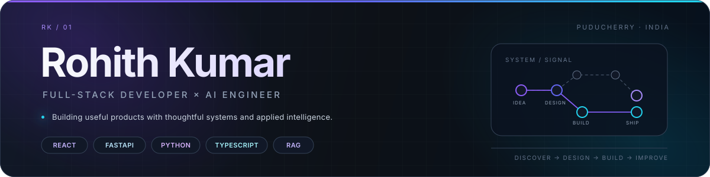

<div align="center">

</div>

<p align="center">
  <a href="#-who-am-i">About</a> &nbsp;·&nbsp;
  <a href="#-whats-up">What I'm Up To</a> &nbsp;·&nbsp;
  <a href="#-high-fidelity-project-showcase">Projects</a> &nbsp;·&nbsp;
  <a href="#-technology-universe">Tech Stack</a> &nbsp;·&nbsp;
  <a href="#-github-galaxy-stats">Stats</a> &nbsp;·&nbsp;
  <a href="#-wakatime--live-coding-analytics">WakaTime</a> &nbsp;·&nbsp;
  <a href="#-mission-2026">Mission 2026</a> &nbsp;·&nbsp;
  <a href="#-connect-with-me">Connect</a>
</p>

<!-- Wave top -->


<br/>

<!-- Typing SVG -->
<p align="center">
  
</p>

<!-- Premium Unified Badge Row -->
<p align="center">
  
  
  
  <br/>
  
  
</p>

<p align="center">
  <br/>
  <a href="https://www.linkedin.com/in/bappadala-rohith-kumar-naidu-19377130a"></a>
</p>

<br/>

---

## 🌌 &nbsp; Who Am I?

Hi, I'm **Rohith Kumar**! 👋 I'm a software engineer specializing in blending full-stack web architectures with AI agents. Whether it's building complex digital banking dashboards or auto-formatting academic manuscripts, I love turning ambitious ideas into elegant, production-ready systems.

```typescript
const rohith: Developer = {
  name        : "Rohith Kumar",
  role        : "Full-Stack Developer & AI Enthusiast",
  education   : "B.Tech CSE @ Sri Manakula Vinayagar Engineering College 🎓",
  location    : "Puducherry, India 🌴",
  languages   : ["Python", "Java", "JavaScript", "TypeScript", "C"],
  frontend    : ["React", "TailwindCSS", "Vite"],
  backend     : ["FastAPI", "Node.js", "Java (Spring Boot)", "Streamlit"],
  databases   : ["PostgreSQL", "Supabase", "MongoDB", "Firebase"],
  cloud       : ["AWS", "GCP", "Docker", "Vercel", "Render"],
  ai_stack    : ["LangChain", "OpenAI API", "NumPy", "Pandas", "Selenium"],
  devTools    : ["Git", "GitHub", "Postman", "Figma", "Notion", "Arduino"],
  passions    : ["Web Dev", "AI/ML", "Hackathons", "Open Source"],
  currentFocus: "Building intelligent, production-ready systems 🧠",
  funFact     : "I debug best at 2am with lo-fi music 🎵",
  goal        : "Build tech that actually changes lives 🌍",
  openTo      : ["Internships", "Collaborations", "Hackathons", "Mentorship"],
};
// 🚀 Status: Currently building something epic → stay tuned!
```

<br>

---

## 🔭 &nbsp; What I'm Up To

<table>
<tr>
<td width="50%" valign="top">

### 🛠️ Building Right Now
- 🌐 Full-stack apps — **React + FastAPI + Supabase**
- ☕ REST microservices — **Java Spring Boot**
- 🤖 AI pipelines — **LangChain + OpenAI API**
- 🚀 Cloud Hosting — deployments on **Vercel, Render & AWS/GCP**

</td>
<td width="50%" valign="top">

### 📚 Currently Learning
- 🧠 **System Design** — Scalable distributed systems
- ⚡ **DSA** — LeetCode daily grind
- ☁️ **AWS Solutions Architect** certification
- 🔗 **LangChain + RAG** — AI agent pipelines
- 🔷 **Supabase** — Postgres-powered BaaS
- 🔒 **Auth & Security** — OAuth2, JWT, RBAC

</td>
</tr>
</table>

<br>

---

## 🌟 &nbsp; High-Fidelity Project Showcase
*Turning complex ideas into production-ready architectures. My focus: AI Ecosystems & Scalable Full-Stack Apps.*

<table width="100%">
  <tr>
    <td width="50%" valign="top">
      <h3>🏦 <a href="https://github.com/rohitkumarnaidu/Modern-Digital-Banking-Dashboard">Aureus: Digital Banking</a></h3>
      <p>A production-grade fintech dashboard developed during a professional internship, featuring real-time financial tracking and secure digital banking modules.</p>
      
      <br/><br/>
      <a href="https://github.com/rohitkumarnaidu/Modern-Digital-Banking-Dashboard"></a>
      &nbsp;
      <a href="https://github.com/rohitkumarnaidu/Modern-Digital-Banking-Dashboard"></a>
    </td>
    <td width="50%" valign="top">
      <h3>🧠 <a href="https://github.com/rohitkumarnaidu/ARIA-OS---SecondBrain-">ARIA OS (Second Brain)</a></h3>
      <p>Comprehensive AI-powered personal knowledge management system integrating LLMs with Retrieval-Augmented Generation (RAG).</p>
      <a href="https://github.com/rohitkumarnaidu/ARIA-OS---SecondBrain-"></a>
      &nbsp;
      <a href="https://github.com/rohitkumarnaidu/ARIA-OS---SecondBrain-"></a>
    </td>
  </tr>
  <tr>
    <td width="50%" valign="top">
      <h3>🔬 <a href="https://github.com/rohitkumarnaidu/agentic-edu-research-assistant">Multi-Agent Researcher</a></h3>
      <p>Autonomous AI Science lab orchestrating Planner, Critic, and Research agents for zero-cost execution.</p>
      
      <br/><br/>
      <a href="https://github.com/rohitkumarnaidu/agentic-edu-research-assistant"></a>
      &nbsp;
      <a href="https://github.com/rohitkumarnaidu/agentic-edu-research-assistant"></a>
    </td>
    <td width="50%" valign="top">
      <h3>🤖 <a href="https://github.com/rohitkumarnaidu/-Auto-AI-Automated-Academic-Docx-Manuscript-Formatter">ScholarForm AI</a></h3>
      <p>Next.js 14 & NVIDIA NIM (Llama 3.3) pipeline for automated academic docx formatting and synthesis.</p>
      
      <br/><br/>
      <a href="https://github.com/rohitkumarnaidu/-Auto-AI-Automated-Academic-Docx-Manuscript-Formatter"></a>
      &nbsp;
      <a href="https://github.com/rohitkumarnaidu/-Auto-AI-Automated-Academic-Docx-Manuscript-Formatter"></a>
    </td>
  </tr>
</table>

<br>

---

## 🛠️ &nbsp; Technology Universe

<div align="center">

### 💬 Languages


### ⚛️ Frontend & Mobile


### ⚙️ Backend & APIs


### 🗄️ Databases & BaaS


### ☁️ Cloud & DevOps


### 🤖 Data, AI & Tools


</div>

<br/>

<details>
<summary>📋 &nbsp; View full stack as badges</summary>
<br/>
<div align="center">


</div>
</details>

<br>

---

## 📊 &nbsp; GitHub Galaxy Stats

<!-- Activity graph (full width) -->
<p align="center">
  
</p>

<br/>

<!-- Stats + Streak side by side -->
<!-- 📊 Interactive Data Hub -->
<p align="center">
  
  &nbsp;
  
</p>

<p align="center">
  
</p>

## 🏆 &nbsp; Competitive Programming Stats

<div align="center">
  <table width="100%">
    <tr>
      <td width="33%" align="center">
        <a href="https://leetcode.com/u/Rohith083/">
          
        </a>
      </td>
      <td width="33%" align="center">
        <a href="https://www.geeksforgeeks.org/profile/bappadalarohithkumarnaidu">
          
        </a>
      </td>
      <td width="33%" align="center" valign="middle">
        <a href="https://www.hackerrank.com/profile/rohitbappadala">
          <b>&lt;/&gt; HackerRank Profile</b><br/><br/>
          <br/>
          <br/><br/>
          
        </a>
      </td>
    </tr>
  </table>
</div>

<br>

---

## ⏱️ &nbsp; WakaTime — Live Coding Analytics

<div align="center">

<!-- Real WakaTime data populated by GitHub Actions -->

</div>

<!-- ⏱️ WakaTime Dynamic Dashboard -->
<p align="center">
  
</p>

<br/>

## 🦉 &nbsp; I'm a Night Owl

<!--START_SECTION:waka-->


**🐱 My GitHub Data** 

> 📦 ? Used in GitHub's Storage 
 > 
> 🏆 1,279 Contributions in the Year 2026
 > 
> 🚫 Not Opted to Hire
 > 
> 📜 13 Public Repositories 
 > 
> 🔑 0 Private Repositories 
 > 
**I'm a Night 🦉** 

```text
🌞 Morning                2410 commits        ██░░░░░░░░░░░░░░░░░░░░░░░   07.73 % 
🌆 Daytime                8399 commits        ███████░░░░░░░░░░░░░░░░░░   26.95 % 
🌃 Evening                15003 commits       ████████████░░░░░░░░░░░░░   48.14 % 
🌙 Night                  5351 commits        ████░░░░░░░░░░░░░░░░░░░░░   17.17 % 
```
📅 **I'm Most Productive on Tuesday** 

```text
Monday                   2785 commits        ██░░░░░░░░░░░░░░░░░░░░░░░   08.94 % 
Tuesday                  9737 commits        ████████░░░░░░░░░░░░░░░░░   31.25 % 
Wednesday                2091 commits        ██░░░░░░░░░░░░░░░░░░░░░░░   06.71 % 
Thursday                 3143 commits        ███░░░░░░░░░░░░░░░░░░░░░░   10.09 % 
Friday                   6270 commits        █████░░░░░░░░░░░░░░░░░░░░   20.12 % 
Saturday                 2292 commits        ██░░░░░░░░░░░░░░░░░░░░░░░   07.35 % 
Sunday                   4845 commits        ████░░░░░░░░░░░░░░░░░░░░░   15.55 % 
```


📊 **This Week I Spent My Time On** 

```text
🕑︎ Time Zone: Asia/Kolkata

💬 Programming Languages: 
TypeScript               14 hrs 48 mins      █████████░░░░░░░░░░░░░░░░   34.74 % 
Python                   14 hrs 9 mins       ████████░░░░░░░░░░░░░░░░░   33.22 % 
Markdown                 7 hrs 27 mins       ████░░░░░░░░░░░░░░░░░░░░░   17.51 % 
Other                    1 hr 46 mins        █░░░░░░░░░░░░░░░░░░░░░░░░   04.17 % 
HTML                     56 mins             █░░░░░░░░░░░░░░░░░░░░░░░░   02.20 % 

🔥 Editors: 
Antigravity IDE          31 hrs 42 mins      ███████████████████░░░░░░   74.41 % 
VS Code                  10 hrs 4 mins       ██████░░░░░░░░░░░░░░░░░░░   23.65 % 
Antigravityide           30 mins             ░░░░░░░░░░░░░░░░░░░░░░░░░   01.19 % 
Antigravity Desktop      11 mins             ░░░░░░░░░░░░░░░░░░░░░░░░░   00.44 % 
Claude Code              7 mins              ░░░░░░░░░░░░░░░░░░░░░░░░░   00.30 % 
```


 Last Updated on 24/06/2026 16:45:43 UTC
<!--END_SECTION:waka-->

---


---

## 🎮 &nbsp; Random Dev Joke

<div align="center">
  
</div>

<br>

---

## 🏆 &nbsp; GitHub Achievements
*Milestones and trophies earned through consistent contribution and open-source impact.*

<p align="center">
  <a href="https://github.com/ryo-ma/github-profile-trophy"></a>
</p>

<br>

---

## 📈 &nbsp; Contribution Heatmap

<p align="center">
  
</p>

<br>

---

## 🔝 &nbsp; Top Contributed Repos
*Actively maintaining and evolving these high-impact open-source systems.*

🏢 **Experience Milestone:** *SDE Intern* @ Professional Internship • Developing Production-Grade Fintech Systems

<div align="center">
  <table width="100%">
    <tr>
      <td width="25%" align="center">
        <b>&nbsp;&nbsp;&nbsp;&nbsp;Aureus&nbsp;&nbsp;&nbsp;&nbsp;</b><br/>
        <br/>
        <a href="https://github.com/rohitkumarnaidu/Modern-Digital-Banking-Dashboard"><sub>View Source</sub></a>
      </td>
      <td width="25%" align="center">
        <b>&nbsp;&nbsp;&nbsp;&nbsp;ARIA&#8209;OS&nbsp;&nbsp;&nbsp;&nbsp;</b><br/>
        <br/>
        <a href="https://github.com/rohitkumarnaidu/ARIA-OS---SecondBrain-"><sub>View Source</sub></a>
      </td>
      <td width="25%" align="center">
        <b>&nbsp;&nbsp;&nbsp;&nbsp;Agentic&nbsp;Edu&nbsp;&nbsp;&nbsp;&nbsp;</b><br/>
        <br/>
        <a href="https://github.com/rohitkumarnaidu/agentic-edu-research-assistant"><sub>View Source</sub></a>
      </td>
      <td width="25%" align="center">
        <b>&nbsp;&nbsp;&nbsp;&nbsp;ScholarForm&nbsp;&nbsp;&nbsp;&nbsp;</b><br/>
        <br/>
        <a href="https://github.com/rohitkumarnaidu/-Auto-AI-Automated-Academic-Docx-Manuscript-Formatter"><sub>View Source</sub></a>
      </td>
    </tr>
  </table>
</div>

<br/>

<br/>

---

## 💬 &nbsp; Testimonials & Recommendations

<p align="center">
  <i>Collaborators, mentors, and teammates — reach out on <a href="https://www.linkedin.com/in/bappadala-rohith-kumar-naidu-19377130a">LinkedIn</a> to add your recommendation here.</i>
</p>

<br/>

---

## ⬡ &nbsp; Real-Time Development Hub

<!--START_SECTION:activity-->
1. 🎉 Merged PR [#1](https://github.com/rohitkumarnaidu/ARIA-OS---SecondBrain-/pull/1) in [rohitkumarnaidu/ARIA-OS---SecondBrain-](https://github.com/rohitkumarnaidu/ARIA-OS---SecondBrain-)
2. 💪 Opened PR [#1](https://github.com/rohitkumarnaidu/ARIA-OS---SecondBrain-/pull/1) in [rohitkumarnaidu/ARIA-OS---SecondBrain-](https://github.com/rohitkumarnaidu/ARIA-OS---SecondBrain-)
3. ❌ Closed PR [#41](https://github.com/rohitkumarnaidu/ScholarFormAI/pull/41) in [rohitkumarnaidu/ScholarFormAI](https://github.com/rohitkumarnaidu/ScholarFormAI)
4. 🗣 Commented on [#41](https://github.com/rohitkumarnaidu/ScholarFormAI/pull/41#issuecomment-4702175968) in [rohitkumarnaidu/ScholarFormAI](https://github.com/rohitkumarnaidu/ScholarFormAI)
5. ❌ Closed PR [#42](https://github.com/rohitkumarnaidu/ScholarFormAI/pull/42) in [rohitkumarnaidu/ScholarFormAI](https://github.com/rohitkumarnaidu/ScholarFormAI)
<!--END_SECTION:activity-->

<br>

---

## 🎯 &nbsp; Mission: 2026

<div align="center">
  <h3>🔭 &nbsp; Mission: 2026 Roadmap</h3>
  <br/>
  
  <table width="80%">
    <tr>
      <td width="50%">
        <b>🤖 AI & Agentic Systems</b><br/>
        💠 <i>Ship a Multi-Agent Researcher SaaS platform</i><br/>
        💠 <i>Perfect the ARIA-OS Second Brain architecture</i><br/>
        💠 <i>Integrate ScholarForm with real academic workflows</i>
      </td>
      <td width="50%">
        <b>☁️ Cloud & Architecture</b><br/>
        💠 <i>Master AWS Solutions Architect & Cloud Security</i><br/>
        💠 <b>Aureus Production:</b> Security Hardening (JWT/AES)<br/>
        💠 <b>Aureus Scale:</b> Redis Caching & Load Balancing<br/>
        💠 <b>Aureus Resilience:</b> Prometheus/Grafana Metrics<br/>
      </td>
    </tr>
    <tr>
      <td colspan="2" align="center">
        <br/>
        <b>🧩 Open Source & Community</b><br/>
        💠 <i>Contribute to 5+ high-impact open-source core libraries</i><br/>
        💠 <i>Win a National-level AI Hackathon trophy</i><br/>
        💠 <i>Author 10+ deep-dive technical articles on Medium/Dev.to</i>
      </td>
    </tr>
  </table>
</div>

<br>

---

## 🌐 &nbsp; Connect With Me

<p align="center">
  <a href="https://www.linkedin.com/in/bappadala-rohith-kumar-naidu-19377130a"></a>
  &nbsp;
  <a href="https://github.com/rohitkumarnaidu"></a>
  &nbsp;
  <a href="mailto:rohitbappadala@gmail.com"></a>
  &nbsp;
  <a href="https://leetcode.com/u/Rohith083/"></a>
</p>

<br>

---

## ✍️ &nbsp; Dev Quote

<div align="center">
  
</div>

<br/>

## 🐍 &nbsp; Contribution Snake

<p align="center">
  <picture>
    <source media="(prefers-color-scheme: dark)" srcset="https://raw.githubusercontent.com/rohitkumarnaidu/rohitkumarnaidu/output/github-contribution-grid-snake-dark.svg"/>
    <source media="(prefers-color-scheme: light)" srcset="https://raw.githubusercontent.com/rohitkumarnaidu/rohitkumarnaidu/output/github-contribution-grid-snake.svg"/>
    
  </picture>
</p>

<!-- Wave footer -->


<p align="center">
  
  <br/><br/>
  <b>⭐ Drop a star on any project you find useful — it genuinely helps!</b>
  <br/>
  <sub>🚀 Let's build something legendary together 🌌</sub>
</p>


